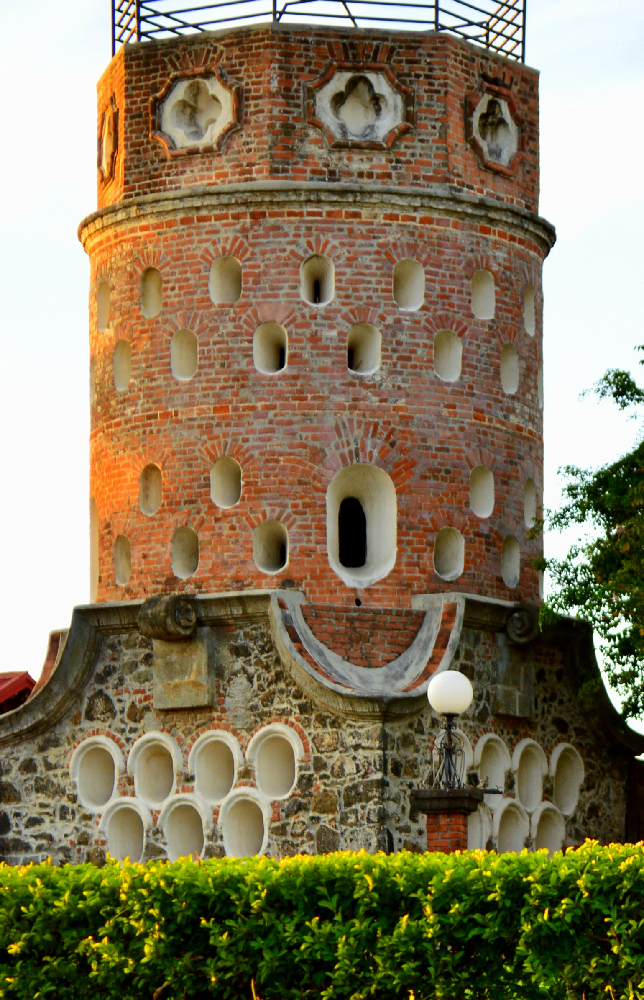

# La provincia de Heredia

Heredia es la provincia 4 de [Costa Rica](https://es.wikipedia.org/wiki/Costa_Rica).

## Ubicación

Se ubica en el centro del país. Limita al norte con **Nicaragua**, al sur con **San José**, al este con **Limón** y al oeste con **Alajuela**.

## Economía

Las principales actividades económicas son el turismo, la ganadería y el comercio.
